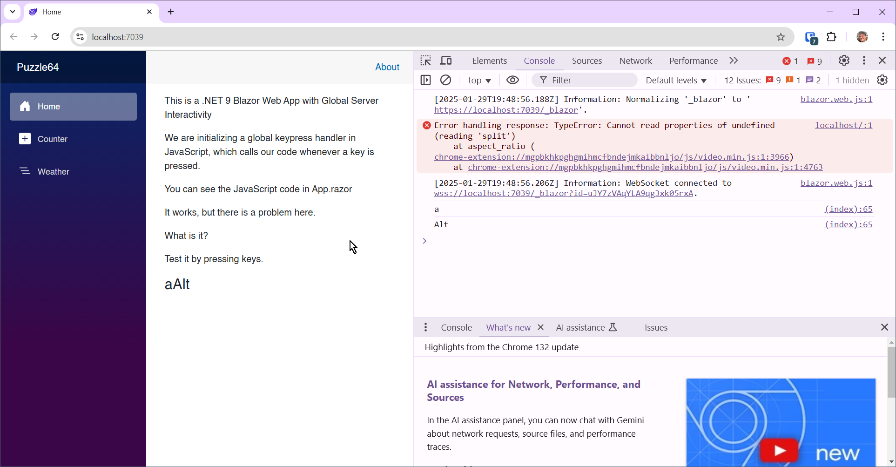
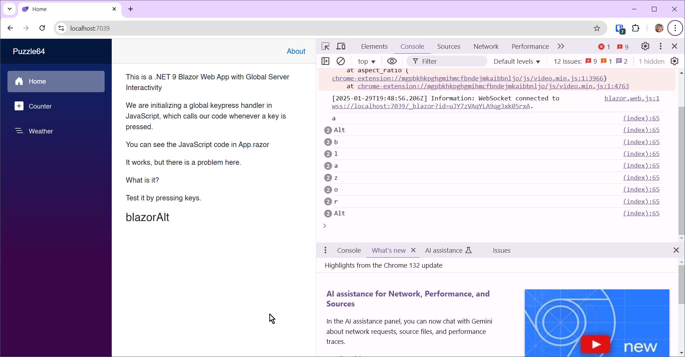
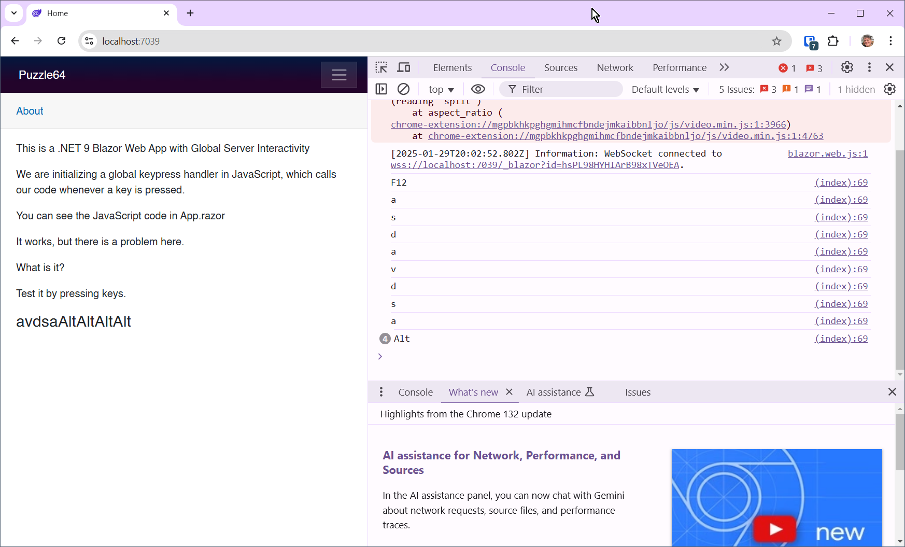

# Blazor Puzzle #64

## A Phantom Menace?

YouTube Video: https://youtu.be/xVO-fbI0MKE

Blazor Puzzle Home Page: https://blazorpuzzle.com

### The Challenge:

This is a .NET 9 Blazor Web App with Global Server Interactivity

We are initializing a global keypress handler in JavaScript, which calls our code whenever a key is pressed.

You can see the JavaScript code in *App.razor*:

```html
<script>
    window.InitializeKeyboardHandler = (dotNetRef) =>
    {
        document.addEventListener('keydown', (event) =>
        {
            dotNetRef.invokeMethodAsync('OnKeyDown', event.key);
        });
    }
</script>
```

*Home.razor*:

```c#
@page "/"
@inject IJSRuntime jsRuntime

<PageTitle>Home</PageTitle>

<p>This is a .NET 9 Blazor Web App with Global Server Interactivity</p>

<p>We are initializing a global keypress handler in JavaScript, which calls our code whenever a key is pressed.</p>

<p>You can see the JavaScript code in App.razor</p>

<p>It works, but there is a problem here.</p>

<p>What is it?</p>

<p>Test it by pressing keys.</p>

<h3>@Message</h3>

@code 
{
    string Message { get; set; } = "";

    protected override async Task OnAfterRenderAsync (bool firstRender)
    {
        if (firstRender)
        {
            await jsRuntime.InvokeVoidAsync("InitializeKeyboardHandler", DotNetObjectReference.Create(this));
        }
    }

    [JSInvokable]
    public async Task OnKeyDown(string key)
    {
        Message += key;
        await InvokeAsync(StateHasChanged);
    }
}
```

It works, but there is a problem here.

What is it?

### The Solution:

The real problem is that every time you navigate to the home page, there's another JavaScript call to initialize the keyboard handler. The new `dotNetRef` takes over, and the old handler is still in memory.

You can witness the problem by changing the script like so:

```html
<script>

    window.InitializeKeyboardHandler = (dotNetRef) =>
    {
        document.addEventListener('keydown', (event) =>
        {
            console.log(event.key);
            dotNetRef.invokeMethodAsync('OnKeyDown', event.key);
        });
    }
</script>
```

Run the app, open the console dev tool pane, and press a key. Notice the `console.log` output:



First I pressed "a", then Alt-PrtScn to take a screen capture.

Now navigate to another page and back and press keys



Notice there are 2 calls to console.log for every key. That means the handler is firing twice. That means the first handler has been stranded, causing a memory leak.

The solution is to create an `RemoveKeyboardHandler` JavaScript method, implement `IDisposable` in *Home.razor*, and unhook the handler in the `Dispose()` method. 

Let's start by changing the script a little in *App.razor*:

```html
<script>

    var keyDownHandler;

    window.InitializeKeyboardHandler = (dotNetRef) => {

        // Define the handler separately so we can remove it later
        keyDownHandler = (event) => {
            console.log(event.key);
            dotNetRef.invokeMethodAsync('OnKeyDown', event.key);
        };

        document.addEventListener('keydown', keyDownHandler);
    };

    window.RemoveKeyboardHandler = () => {
        if (keyDownHandler) {
            document.removeEventListener('keydown', keyDownHandler);
            keyDownHandler = null; // Clear reference to prevent memory leaks
        }
    };
</script>
```

Now, replace *Home.razor* with this:

```c#
@page "/"
@implements IAsyncDisposable
@inject IJSRuntime jsRuntime

<PageTitle>Home</PageTitle>

<p>This is a .NET 9 Blazor Web App with Global Server Interactivity</p>

<p>We are initializing a global keypress handler in JavaScript, which calls our code whenever a key is pressed.</p>

<p>You can see the JavaScript code in App.razor</p>

<p>It works, but there is a problem here.</p>

<p>What is it?</p>

<p>Test it by pressing keys.</p>

<h3>@Message</h3>

@code 
{
    string Message { get; set; } = "";
    bool Loaded = false;
    DotNetObjectReference<Home> dotNetObjectReference;

    protected override async Task OnAfterRenderAsync (bool firstRender)
    {
        if (firstRender)
        {
            dotNetObjectReference = DotNetObjectReference.Create(this);
            await jsRuntime.InvokeVoidAsync("InitializeKeyboardHandler", dotNetObjectReference);
            Loaded = true;
        }
    }

    [JSInvokable]
    public async Task OnKeyDown(string key)
    {
        Message += key;
        await InvokeAsync(StateHasChanged);
    }

    public async ValueTask DisposeAsync()
    {
        if (Loaded) 
        {
            await jsRuntime.InvokeVoidAsync("RemoveKeyboardHandler");
            dotNetObjectReference.Dispose();
        }
    }
}
```

We are implementing `IAsyncDisposable`:

```
@implements IAsyncDisposable
```

We've also introduced this boolean:

```c#
bool Loaded = false;
```

... and this reference variable:

```c#
DotNetObjectReference<Home> dotNetObjectReference;
```

We create the .NET Object Reference, and then set Loaded to true after initializing the handler:

```c#
protected override async Task OnAfterRenderAsync (bool firstRender)
{
    if (firstRender)
    {
        dotNetObjectReference = DotNetObjectReference.Create(this);
        await jsRuntime.InvokeVoidAsync("InitializeKeyboardHandler", dotNetObjectReference);
        Loaded = true;
    }
}
```

Now in `DisposeAsync()` we are calling `RemoveKeyboardHandler` only if we are loaded. This prevents a runtime error that happens when called during pre-rendering. We also dispose the .NET Object reference.

```c#
public async ValueTask DisposeAsync()
{
    if (Loaded) 
    {
        await jsRuntime.InvokeVoidAsync("RemoveKeyboardHandler");
        dotNetObjectReference.Dispose();
    }
}
```

> :point_up: NOTE: We didn't dispose the `DotNetObjectReference` in the video. This occurred to us after we recorded it.

Do the same test again. This time, you don't get more than one event, because we have removed the keyboard handler when we navigated away from the Home page.



Boom!
